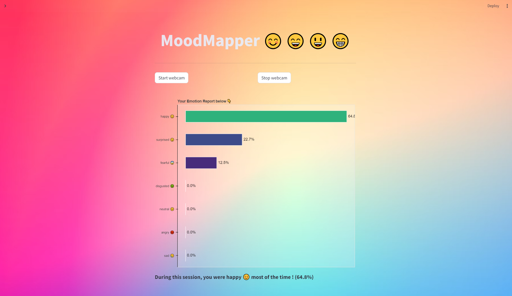

# MoodMapper

<table align="center">
  <tr>
    <td align="center">
      
<b>Overview of MoodMapper's homepage</b>

      
    </td>
    <td>
      
<b>Application Demo</b>

      
    </td>
    <td>
      
<b>After stopping camera feed</b>

      
    </td>
  </tr>
</table>

### Foreword
This repository contains an implementation of a CNN aiming at performing Facial Expression Recognition (FER). It has been trained on this [Kaggle](https://www.kaggle.com/datasets/ananthu017/emotion-detection-fer) dataset. Additionally, it features MoodMapper, an user-friendly Streamlit application crafted to perform real-time emotion analysis through webcam feed.
It is worth emphaszing that this is a very prosaic CNN implementation for FER. Consequently, it is not intended to achieve SOTA performances whatsoever, as suggested by the learning curves displayed hereinafter.

### Overview of the Repository
- `model/`: Contains `emotion_detector.pt`, the trained CNN model for facial expression recognition.
- `notebook/`: Contains `Emotion_Detection.ipynb`, a Jupyter notebook providing an in-depth exploration of the facial expression recognition model. It includes detailed explanations of the model architecture, training process, and evaluation metrics, offering insights into the development and performance of the model.
- `images/`: Contains visualizations such as the confusion matrix of the trained model and the learning curves (accuracy and loss) obtained during training. 
- `home.py`: The main Python script comprising the overall layout of the application. It includes HTML and CSS incorporated as markdown, as well as the global logic for opening and closing the camera,  and running real-time emotion detection tasks. This script serves as the backbone of the MoodMapper application, orchestrating the smooth functioning of the user interface and its functionalities.
- `utils.py` Encompasses essential functions and classes used throughout the application.

### How to run?
Follow these steps to run the MoodMapper application locally:

1. Clone the project repository: `git clone https://github.com/OneLeoTav/MoodMapper.git`
2. Navigate to the root of the directory: `cd MoodMapper/`
3. Install the required Python packages: `pip install -r requirements.txt`
4. Run the Streamlit application: `streamlit run home.py`
5. Access the application locally at http://[172.20.10.7:8501](http://172.20.10.7:8501).

## Project Outline
Built upon Convolutional Neural Network, MoodMapper analyzes your emotions in real-time through your camera feed and keeps track of the emotions you experience, then automatically provides you with an interactive mood report at the end of the session.

### Main Features
- **Real-Time Emotion Detection:** Receive instant feedback on your current emotional state, via live emotion recognition through your camera feed
- **Comprehensive Mood Reports:** Explore detailed analyses and interactive visual representations of your emotional patterns over the session.
- **Intuitive Interface:** Navigate effortlessly through a sleek and user-friendly interface.

### Technologies Used
- **Python:** Backend development and integration of the convolutional neural network (CNN) for facial expression recognition.
- **PyTorch:** Training and deployment of the neural network model, a CNN architecture with 3 convolutional layers and 4 linear layers.
- **OpenCV:** Image processing library for real-time face detection and preprocessing of facial images before input to the neural network.
- **Streamlit:** Web framework for building the user interface.
- **Bokeh:** Interactive visualization library for creating dynamic emotion reports.
- **Pandas:** Data manipulation and analysis for generating insightful emotional analytics.
- **HTML/CSS:** Styling and layout design for creating an appealing interface.

## Aperçu du Projet
Basé sur un Réseau de Neurones Convolutif (CNN), MoodMapper analyse vos émotions en temps réel à travers le flux vidéo de votre caméra/webcam. MoodMapper garde un œil sur les émotions que vous ressentez au cours d’une session et génère ensuite un rapport interactif résumant ces dernières.

**Principales fonctionnalités :**
- **Détection d'émotion en temps réel :** Recevez un retour instantané sur votre état émotionnel actuel, par le biais de la reconnaissance émotionnelle en temps réel à travers le flux vidéo de votre caméra. 
- **Rapports émotionnels :** Obtenez une analyse détaillée, accompagnée d’une visualisation interactive, des émotions ressenties au cours de la session.
- **Interface intuitive :** Naviguez sans effort à travers une interface ergonomique et raffinée.

**Technologies utilisées :**
- **Python :** Développement backend et intégration du réseau de neurones convolutif pour la reconnaissance émotionnelle.
- **PyTorch :** Entraînement et déploiement du CNN, une architecture avec 3 couches convolutionnelles et 4 couches linéaires.
- **OpenCV :** Bibliothèque de traitement d'images pour la détection faciale en temps réel et le prétraitement des images.
- **Streamlit :** Framework web pour la construction de l'interface utilisateur.
- **Bokeh :** Bibliothèque de visualisation interactive pour la création de visualisations dynamiques.
- **Pandas :** Manipulation des données pour la génération.
- **HTML/CSS :** Design et look général de la page.

## Panorama del Proyecto
Basado en una Red Neuronal Convolucional (CNN), MoodMapper analiza sus emociones en tiempo real a través del flujo de vídeo de su cámara/webcam. MoodMapper mantiene un ojo vigilante sobre todas las emociones que usted experimenta durante una sesión y genera automáticamente un informe interactivo que las resume.

**Funcionalidades principales:**
- **Detección de emociones en tiempo real:** Reciba un feedback instantáneo sobre su estado emocional actual con reconocimiento emocional en tiempo real, a través del flujo de vídeo de su cámara.
- **Informes emocionales:** Obtenga un análisis detallado, acompañado de una visualización interactiva, de las emociones experimentadas durante la sesión.
- **Interfaz intuitiva:** Navegue sin esfuerzo a través de una interfaz ergonómica y refinada.

**Tecnologías utilizadas:**
- **Python:** Desarrollo del backend e integración de la red neuronal convolucional para el reconocimiento emocional.
- **PyTorch:** Entrenamiento y despliegue del CNN, una arquitectura con 3 capas convolucionales y 4 capas lineales.
- **OpenCV:** Biblioteca de procesamiento de imágenes para la detección facial en tiempo real y el preprocesamiento de imágenes.
- **Streamlit:** Framework web para la construcción de la interfaz de usuario.
- **Bokeh:** Biblioteca de visualización interactiva para la creación de visualizaciones dinámicas.
- **Pandas:** Manipulación de datos para la generación.
- **HTML/CSS:** Diseño general de la página.

